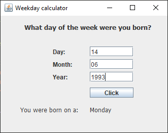

# Short Description:
This is a simple GUI made in JavaFX. The user can input any date and the algorithm in the code will retrieve what weekday it was or will be on that date. For example, entering 14 june 1993 was on a Monday. 

This application uses Zeller's congruence.

# Getting Started as a developer:
git clone or pull the project. 
```sh 
git clone
```

# Screenshots:


